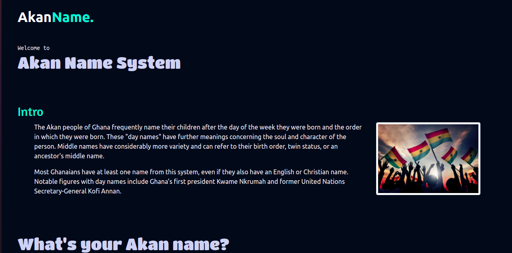
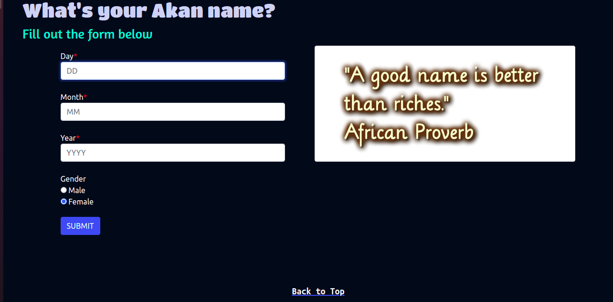
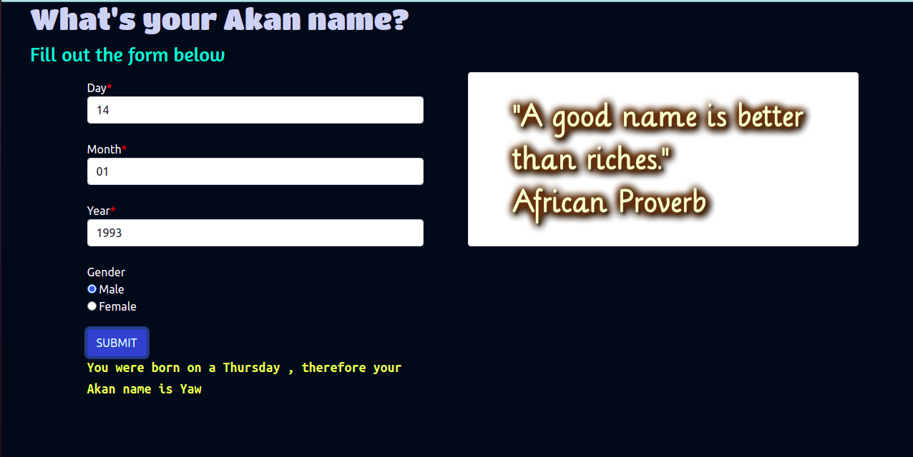

## Table of Contents

- Project Title
- Description
- Deployment
- BDD (Behaviour Driven Development)
- Project Preview
- Technologies used
- Bugs
- Acknowledgement
- Contacts
- Author

# AKAN NAMING SYSTEM

## DESCRIPTION

- This website was inspired by how the Akan tribe from Ghana determine their new-born's first name.

The website outputs the Akan name depending on gender and DOB.

## Deployment

- You can vist the site directly by clicking [HERE](https://mrbrianomollo.github.io/akannames/)
- You can view the source code on github [HERE](https://github.com/mrbrianomollo/akannames.git)

## BDD

> You will be required to fill out the the DOB form and gender.
> The website will calculate the day depending on the details you input and will output the name that is associated with the specific day.

- NB : `All input should be Numbers`

## Project Screenshot

- This is the landing page of the website. It has a brief description of what Akan name is.

- This is the section where one gets to fill out the form.

- After filling out the form you should get an output highlighted in yellow as demonstrated on the picture.

## Technologies Used

- html
- css
- javascript
- bootsrap

## Bugs

I noticed when keying in 21st century dates the date is displayed correctly however the name is displayed wrongly. I welcome any contributor who would want to debug the code.

## Acknowledgement

I would like to thank the following for their assistance through out this project.

- The Almighty God
- Tevin (collegue) for his assistance for his assistance in the project
- And finally Myself

## Contacts

Incase of any feedback you can reach me through my personal contacts:

- mrbrianomollo@gmail.com
- 0723670846

## Author

> **Brian Ongati**
